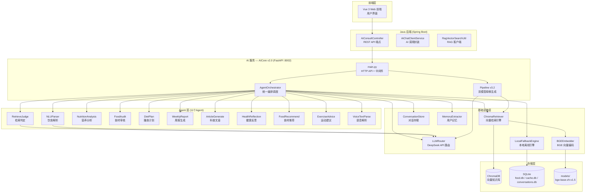
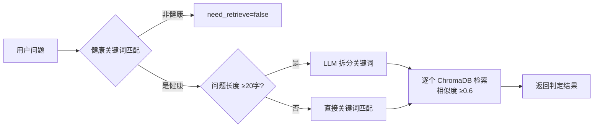
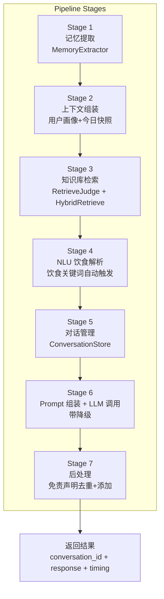
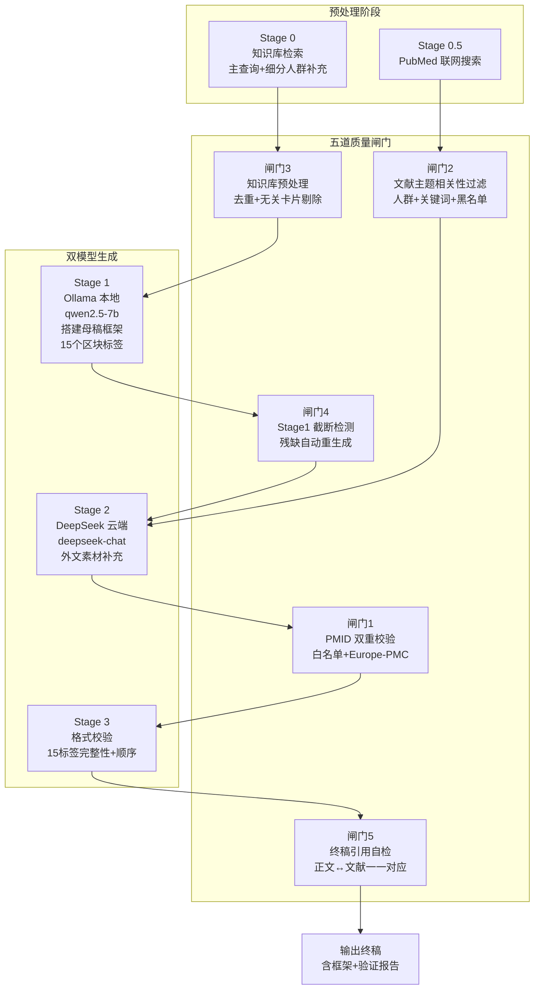
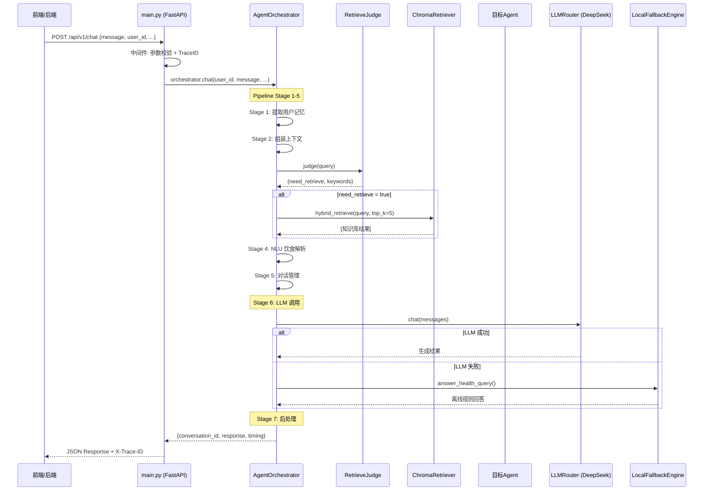
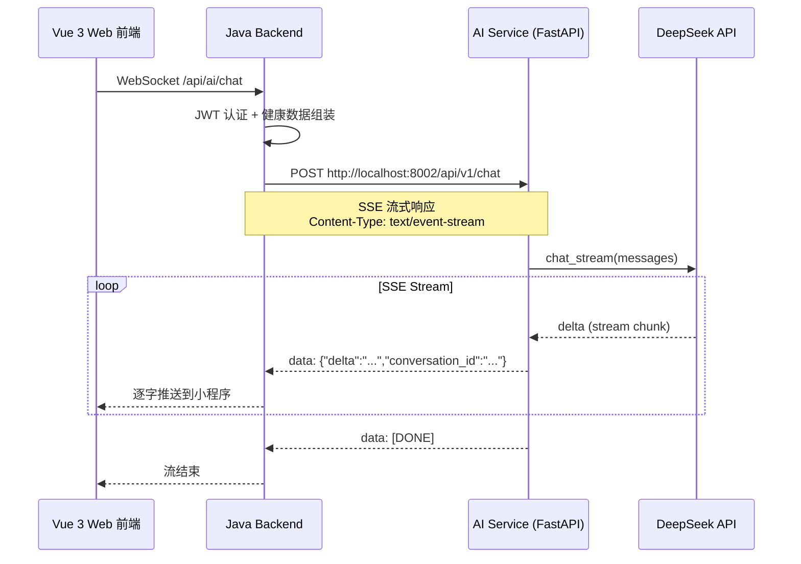
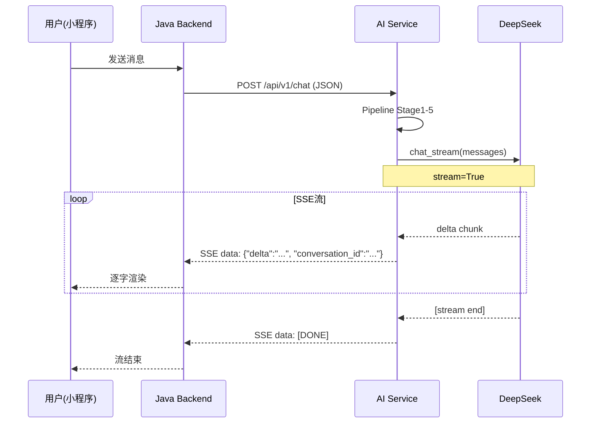
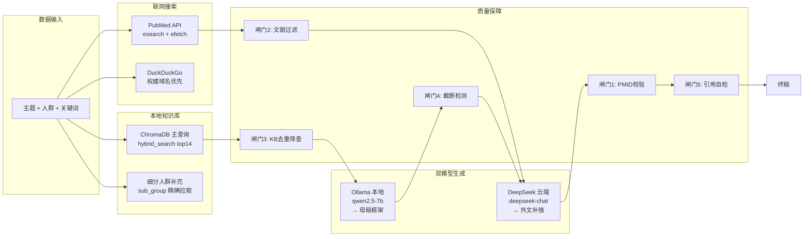

# AI 模块架构设计文档

> **项目名称**：个人健康管理系统 — AICore v2.0  
> **版本**：2.0.0  
> **更新日期**：2025-08-05  
> **文档类型**：架构设计文档

---

## 目录

1. [概述](#1-概述)
2. [模块划分与职责](#2-模块划分与职责)
3. [核心算法与实现逻辑](#3-核心算法与实现逻辑)
4. [与其他模块的交互方式](#4-与其他模块的交互方式)
5. [数据流图](#5-数据流图)
6. [部署与配置](#6-部署与配置)

---

## 1. 概述

### 1.1 AI 服务的定位与职责

AI 服务（AICore v2.0）是个人健康管理系统的智能大脑，运行于独立的 Python FastAPI 进程中。它负责接收来自 Java 后端（Spring Boot）的健康咨询请求，通过多 Agent 编排、向量知识库检索（RAG）和 LLM 生成，返回高质量的膳食建议、营养分析、食谱推荐、科普文章等结构化内容。

**核心职责：**

| 职责 | 说明 |
|------|------|
| **智能健康咨询** | 基于用户画像 + 知识库 + LLM 的多轮对话，提供个性化健康建议 |
| **饮食记录解析（NLU）** | 将自然语言（语音/OCR/自由文本）饮食描述自动解析为结构化营养数据 |
| **营养分析** | 摄入热量 vs BMR 对比、宏量/微量营养素评估、疾病风险评估 |
| **科普文章生成** | 基于 v3.2 双模型流水线的权威母稿生成（本地 Ollama + 云端 DeepSeek） |
| **膳食方案制定** | 过敏食材自动过滤、饮食禁忌替换、人群标签匹配 |
| **食材审核与菜谱推荐** | 食材热量评估、菜谱拆解还原、智能推荐 |
| **运动建议与周报** | 个性化运动计划、健康周报生成 |
| **离钱兜底** | LLM 不可用时自动切换本地规则引擎，确保 7×24 可用 |

### 1.2 整体架构概览



### 1.3 技术栈一览

| 层级 | 技术 | 说明 |
|------|------|------|
| Web 框架 | **FastAPI** | 异步 HTTP 服务，自带 Swagger 文档 |
| LLM 引擎 | **DeepSeek API + Ollama（本地 qwen2.5-7b）** | 云端为主，本地为辅 |
| 向量模型 | **BGE-base-zh-v1.5**（768维） | 本地 SentenceTransformer 编码 |
| 向量数据库 | **ChromaDB**（PersistentClient） | 轻量嵌入式向量存储 |
| 检索算法 | **BM25 + 向量双路** + RRF 融合 | 混合检索，权威加权 |
| 关系数据库 | SQLite（对话、缓存、记忆、食物数据） | 嵌入式零配置 |
| 日志 | **Loguru** | 结构化日志 + TraceID 链路追踪 |
| 测试 | **pytest** | 单元测试框架 |
| 外部工具 | duckduckgo_search, BeautifulSoup | 联网知识获取 |

---

## 2. 模块划分与职责

### 2.1 目录结构

```
ai_service/
├── main.py                     # FastAPI 主入口，API 端点定义
├── pipeline_v32.py             # v3.2 双模型母稿生成流水线
├── local_fallback_engine.py    # 本地离线规则兜底引擎
├── agent/                      # Agent 层（11个独立 Agent）
│   ├── base.py                 # Agent 基类（统一 LLM/检索/免责声明）
│   ├── orchestrator.py         # 统一编排调度器
│   ├── retrieve_judge.py       # 检索判定 Agent
│   ├── nlu_parser.py           # NLU 自然语言饮食解析引擎
│   ├── nutrition_analysis.py   # 营养分析 Agent
│   ├── food_audit.py           # 食材审核 Agent
│   ├── diet_plan.py            # 膳食计划 Agent
│   ├── weekly_report.py        # 周报 Agent
│   ├── article_generate.py     # 科普文章 Agent
│   ├── health_reflection.py    # 健康反思 Agent
│   ├── food_recommend.py       # 食材菜谱推荐 Agent
│   ├── exercise_advice.py      # 运动建议 Agent
│   └── voice_text_parse.py     # 语音文本解析 Agent
├── config/
│   └── settings.py             # 全局配置类
├── constants/
│   └── food_units.py           # 食物单位换算常量
├── conversation/
│   ├── store.py                # 对话存储（SQLite）
│   └── memory_extract.py       # 用户长期记忆提取
├── llm/
│   └── router.py               # LLM 路由 + Token 追踪
├── vector/
│   ├── embedder.py             # BGE 向量编码器
│   └── retriever.py            # ChromaDB 检索引擎
├── services/
│   ├── retrieval_service.py    # 统一检索服务
│   └── disclaimer.py           # 免责声明管理
├── utils/
│   ├── retrieval_utils.py      # BM25 + RRF 融合工具
│   ├── cache_utils.py          # Agent 结果缓存
│   ├── json_utils.py           # JSON 工具
│   ├── quality_scorer.py       # 回答质量评分
│   ├── retry_utils.py          # ChromaDB 重试装饰器
│   └── log_config.py           # Loguru 日志配置
├── knowledge/                  # 知识数据
│   ├── chroma_db_storage/      # ChromaDB 持久化数据
│   └── pdfs/                   # PDF 原始文献
├── knowledge_base/             # 知识库 JSON 导出
├── models/
│   └── bge-base-zh-v1.5/       # 本地向量模型
├── data/                       # SQLite 数据库文件
├── tests/                      # 测试用例
└── dashboard/                  # 可视化面板（静态 HTML）
```

### 2.2 Agent 详细说明

#### 2.2.1 RetrieveJudgeAgent（检索判定 Agent）

- **文件**：`agent/retrieve_judge.py`
- **职责**：判定用户问题是否需要触发向量知识库检索，拆分复杂多问题为多个检索关键词
- **核心逻辑**：
  1. 关键词匹配：包含"营养""膳食""糖尿病"等健康关键词 → `need_retrieve=true`
  2. 复杂问题拆分：使用 LLM 将长文本多问题拆分为 ≤5 个检索关键词
  3. 知识存在性检查：每个关键词进行 ChromaDB 检索，相似度 ≥0.6 则标记 `has_knowledge=true`
- **接口**：`judge(query: str) -> dict`



#### 2.2.2 NLUParser（自然语言饮食解析引擎）

- **文件**：`agent/nlu_parser.py`
- **职责**：将语音/OCR/自由文本的饮食描述解析为结构化营养数据（食物名称 + 重量 + 营养值）
- **核心逻辑**：
  1. **LLM 提取**：DeepSeek 从文本中提取食物名称、数量、餐次
  2. **模糊匹配**：将食物名称与 SQLite 食物数据库进行精确→去括号→包含→部分字匹配
  3. **单位换算**：自然语言单位（碗/个/杯/根）→ 克（g），通过 `UNIT_TO_GRAMS` 常量映射
  4. **菜品智能还原**：复合菜品（宫保鸡丁、红烧肉等）按食材配方拆解为独立食材
  5. **营养计算**：每 100g 营养素 × (实际克数 / 100)
- **接口**：`parse(text: str) -> dict`, `parse_meal(text: str, meal_type: str) -> dict`
- **返回结构**：`{ meals, daily_totals, warnings, provider }`

#### 2.2.3 NutritionAnalysisAgent（营养分析 Agent）

- **文件**：`agent/nutrition_analysis.py`
- **职责**：对比用户每日营养摄入与标准值，生成营养分析报告
- **核心指标**：BMR 计算（Mifflin-St Jeor 公式）、三大营养素供能比、膳食纤维/钙/叶酸/DHA 评估
- **输出**：营养优势项、劣势项、疾病风险预警、改进建议

#### 2.2.4 FoodAuditAgent（食材审核 Agent）

- **文件**：`agent/food_audit.py`
- **职责**：审核用户提交的食材信息，评估热量、营养标签、重复/冲突检测
- **核心逻辑**：食物名称匹配 → 份量换算 → 热量估算 → 营养标签生成 → 审核等级判定

#### 2.2.5 DietPlanAgent（膳食计划 Agent）

- **文件**：`agent/diet_plan.py`
- **职责**：基于用户档案生成个性化一日三餐食谱
- **特色**：
  - **过敏食材强制过滤**：从菜谱中完全移除过敏源
  - **饮食禁忌替换**：素食→替换肉类为豆制品，不吃牛肉→替换为鸡胸肉/鱼肉
  - **人群匹配**：糖尿病患者低GI，健身人群高蛋白
- **内置数据**：`ALLERGEN_SUBSTITUTES`（过敏替代映射）、`DIETARY_RESTRICTIONS`（禁忌规则）、`DEFAULT_MEALS`（默认模板）

#### 2.2.6 WeeklyReportAgent（周报 Agent）

- **文件**：`agent/weekly_report.py`
- **职责**：生成一周健康总结报告（摄入趋势、运动统计、建议）
- **输入**：`user_profile` + `weekly_stats`

#### 2.2.7 ArticleGenerateAgent（科普文章 Agent）

- **文件**：`agent/article_generate.py`
- **职责**：基于主题和人群生成结构化科普文章
- **输出**：包含标题、摘要、正文、关键词、参考文献的结构化文章

#### 2.2.8 HealthReflectionAgent（健康反思 Agent）

- **文件**：`agent/health_reflection.py`
- **职责**：基于用户健康数据（BMI、血压、血糖等）进行风险评估和健康反思

#### 2.2.9 FoodRecommendAgent（食材推荐 Agent）

- **文件**：`agent/food_recommend.py`
- **职责**：基于已有食材推荐菜谱，估算营养和热量
- **输入**：`ingredients`（食材列表）、`crowd_type`、`goal`

#### 2.2.10 ExerciseAdviceAgent（运动建议 Agent）

- **文件**：`agent/exercise_advice.py`
- **职责**：生成个性化周运动计划（运动类型、时长、强度、热量消耗）

#### 2.2.11 VoiceTextParseAgent（语音解析 Agent）

- **文件**：`agent/voice_text_parse.py`
- **职责**：从语音识别文本中提取食物条目

### 2.3 AgentOrchestrator（统一编排调度器）

- **文件**：`agent/orchestrator.py`
- **职责**：所有 API 端点的唯一调度入口，统一管理：
  1. **Agent 路由分发**：根据 `agent_name` 自动路由到对应的 Agent
  2. **上下文组装**：用户记忆 + 健康快照 + 知识检索 → 完整上下文
  3. **缓存管理**：Agent 结果按 `agent_name + user_id + params_hash` 缓存
  4. **超时降级**：LLM 调用失败 → 自动切 `LocalFallbackEngine`
  5. **运行统计**：`_stats` 记录每个 Agent 的调用次数、成功率、平均耗时、LLM 失败次数

**Pipe-and-Filter 架构（chat 方法）：**



### 2.4 支持模块

| 模块 | 文件 | 职责 |
|------|------|------|
| **LLMRouter** | `llm/router.py` | DeepSeek API 调用封装，异常分类（超时/密钥/限流），Token 用量追踪 |
| **TokenTracker** | `llm/router.py` | 每日 Token 消耗记录（SQLite），超限自动拦截 |
| **BGEEmbedder** | `vector/embedder.py` | 加载 `bge-base-zh-v1.5` 模型，文本 → 768维向量 |
| **ChromaRetriever** | `vector/retriever.py` | ChromaDB 向量检索 + BM25 混合检索 + 权威加权 |
| **BM25Retriever** | `utils/retrieval_utils.py` | 纯 Python BM25 实现（中文 bi-gram 分词） |
| **RRF Fusion** | `utils/retrieval_utils.py` | 多路检索结果 RRF 融合重排 |
| **LocalFallbackEngine** | `local_fallback_engine.py` | 全场景离线规则兜底（BMI、饮食、GI值、食谱、周报等） |
| **ConversationStore** | `conversation/store.py` | SQLite 多轮对话存储 |
| **MemoryExtractor** | `conversation/memory_extract.py` | 从对话中提取用户长期记忆（饮食偏好、过敏史等） |
| **RetrievalService** | `services/retrieval_service.py` | 统一知识库检索服务（消除 Agent 间重复代码） |
| **Disclaimer** | `services/disclaimer.py` | 统一免责声明管理 |
| **QualityScorer** | `utils/quality_scorer.py` | AI 回答质量评分 |

---

## 3. 核心算法与实现逻辑

### 3.1 RAG 向量检索流程

系统采用 **双路混合检索 + RRF 融合 + 权威加权** 的三层检索架构：

```mermaid
flowchart TB
    subgraph "检索判定"
        A[用户查询] --> B[RetrieveJudgeAgent]
        B -->|need_retrieve=false| C[跳过检索]
        B -->|need_retrieve=true| D[拆分关键词]
    end

    subgraph "双路检索"
        D --> E[向量检索路<br/>Chromadb.query()]
        D --> F[BM25 检索路<br/>BM25Retriever.search()]
        E --> G["BGE 向量编码<br/>encode_query()<br/>→ 768维向量"]
        F --> H["中文 bi-gram 分词<br/>+ BM25 评分"]
    end

    subgraph "融合层"
        G --> I[RRF 融合<br/>vector_weight=0.6<br/>bm25_weight=0.4]
        H --> I
        I --> J[字符重叠去重<br/>Jaccard ≥ 0.95 去重]
        J --> K[权威加权 Boost<br/>权威来源 ×1.2 权重]
        K --> L[上下文截断<br/>≤800 字符/条]
    end

    L --> M[返回 Top-K 结果]
```

#### 3.1.1 BGE 向量编码

- **模型**：`bge-base-zh-v1.5`（`./models/bge-base-zh-v1.5/`）
- **维度**：768
- **编码方式**：SentenceTransformer，`local_files_only=True`（完全离线）
- **查询前缀**：`"为这个句子生成向量以用于检索: {query}"`
- **归一化**：`normalize_embeddings=True`（余弦相似度 = 点积）

#### 3.1.2 ChromaDB 向量检索

- **客户端**：`chromadb.PersistentClient(path="./knowledge/chroma_db_storage")`
- **集合名**：`health_knowledge`
- **相似度阈值**：`MIN_SIMILARITY_THRESHOLD = 0.15`（过滤极低相似度）
- **去重阈值**：`DUPLICATE_SIMILARITY_THRESHOLD = 0.95`
- **元数据过滤**：支持 `target_crowd` 人群过滤（OR 条件：精确人群匹配 OR 通用分类）

#### 3.1.3 BM25 关键词检索

- **实现**：纯 Python，无三方依赖
- **分词**：中文 bi-gram + 原词保留 + 单字，过滤中文停用词
- **参数**：`k1=1.5, b=0.75`（标准 BM25 参数）
- **索引构建**：从 ChromaDB 全量加载文档建立倒排索引

#### 3.1.4 RRF 融合算法

```
RRF_score(doc) = Σ weight_i / (k + rank_i + 1)

参数：
  k = 60（平滑常数）
  vector_weight = 0.6, bm25_weight = 0.4
```

#### 3.1.5 权威加权

检测到以下来源时 ×1.2 加权：中国居民膳食指南、中国食物成分表、WS/T 标准、GB 国标、卫健委、中国营养学会等。

### 3.2 母稿生成流水线（pipeline_v32.py）

v3.2 双模型流水线采用 **五道质量闸门** 保障输出质量：



#### 3.2.1 Stage 1：本地搭框架

- **模型**：Ollama `qwen2.5-7b-q4km`（本地 D 盘存储）
- **上下文自适应策略**：`16384 → 12288 → 8192 → 6144 → 4096 → 2048` 逐级降级
- **输出**：15 个固定区块标签的完整科普母稿框架：

```
【#META#】              - 元数据（标题、人群、分类、阅读时长、权威来源）
【#ALL_INTRO#】         - 通用引言
【#SUMMARY_FAST#】      - 速读卡摘要（~40字，纯实操）
【#SUMMARY_DEEP#】      - 深度文摘要（~60字，核心方向）
【#SUMMARY_ALL#】       - 综述摘要（~80字，学界共识+分歧）
【#COMMON_BEGIN#】…【#COMMON_END#】  - 共识基础内容（~600字）
【#DEEP_PLUS_BEGIN#】…【#DEEP_PLUS_END#】  - 深度拓展（~900字）
【#DEBATE_ZONE_BEGIN#】…【#DEBATE_ZONE_END#】  - 学术争议（~300字）
【#CONCLUDE_FAST#】     - 速读结论
【#CONCLUDE_DEEP#】     - 深度结论
【#CONCLUDE_ALL#】      - 综述结论
【#REF_LIST#】          - 参考文献
```

#### 3.2.2 Stage 2：云端外扩

- **模型**：DeepSeek-chat
- **功能**：仅补充外文文献（PubMed）的数据，不修改框架结构
- **PMID 白名单**：严格限定只能引用 Stage 0.5 获取的真实 PMID

#### 3.2.3 五道质量闸门

| 闸门 | 阶段 | 功能 | 说明 |
|------|------|------|------|
| **闸门3** | 预处理 | 知识库去重+筛查 | 按标题去重（保留最高相似度），剔除遗传病/孕期/老年的无关卡片 |
| **闸门2** | 预处理 | 文献主题过滤 | 人群匹配（如青少年→保留 adolescent/children 文献，排除 infant/elderly） |
| **闸门4** | Stage 1 | 截断检测 | 检测 15 标签完整性 + REF_LIST 有效性 + 末尾句子完整性，自动重生成 |
| **闸门1** | Stage 2.5 | PMID 双重校验 | 第一层：PubMed API 白名单；第二层：Europe-PMC API 复核（兼容预印本） |
| **闸门5** | 最终 | 引用自检 | 正文角标 ↔ 文末参考文献一一对应，无关文献剔除，官方指南自动补充 |

### 3.3 Agent 编排流程



---

## 4. 与其他模块的交互方式

### 4.1 与 Java 后端的交互

Java 后端通过 HTTP REST 调用 AI 服务，主要交互类为 `AiChatClientService.java`（HTTP 通信）、`AiChatContextBuilder.java`（上下文组装）和 `RagVectorSearchUtil.java`。咨询/营养/运动/文章按业务域拆分为 `AiConsultService` / `AiNutritionService` / `AiExerciseService` / `AiContentService`，熔断由独立组件 `CircuitBreaker`（@Component 单例，全局共享状态）统一管理。



**关键 API 端点映射：**

| Java 后端调用 | AI 服务端点 | HTTP Method | 说明 |
|---------------|------------|-------------|------|
| AiChatClientService / AiConsultService | `/api/v1/chat` | POST | 多轮对话（核心入口） |
| 饮食记录 | `/api/v1/meal/parse` | POST | NLU 饮食解析 |
| 营养分析 | `/api/v1/nutrition/analyze` | POST | 日营养分析 |
| 食材审核 | `/api/v1/food/audit` | POST | 食材热量评估 |
| 膳食计划 | `/api/v1/diet/plan` | POST | 个性化食谱 |
| 周报 | `/api/v1/report/weekly-summary` | POST | 周健康报告 |
| RAG 检索 | `/api/v1/retrieve` | POST | 知识库查询 |
| 食材推荐 | `/api/v1/food/recommend` | POST | 菜谱推荐 |
| 运动建议 | `/api/v1/exercise/advice` | POST | 运动计划 |
| 健康检查 | `/health` | GET | 服务状态 |

### 4.2 中间件与请求处理

AI 服务通过三层中间件确保请求质量：

1. **CORS 中间件**：`allow_origins=["*"]`，允许跨域
2. **请求校验中间件**：必填字段校验 + 超长文本截断（≤500字符）
3. **TraceID 中间件**：每个请求生成唯一 `trace_id`（12 位 hex），注入响应头 `X-Trace-ID` + `X-Response-Time`

### 4.3 SSE 流式输出

AI 服务通过 DeepSeek API 的 `stream=True` 模式实现逐字推送：

```python
# llm/router.py - chat_stream 方法
def chat_stream(self, messages, model=None):
    stream = self.client.chat.completions.create(
        model=model_name,
        messages=messages,
        temperature=0.7,
        stream=True,           # ← 启用流式
        timeout=settings.LLM_TIMEOUT,
    )
    for chunk in stream:
        delta = chunk.choices[0].delta.content
        if delta:
            yield delta           # ← 逐块返回
```

### 4.4 内部模块依赖关系

```
main.py
  ├── agent/orchestrator.py (全局单例 orchestrator)
  │   ├── agent/retrieve_judge.py
  │   ├── agent/nlu_parser.py
  │   ├── agent/nutrition_analysis.py → agent/base.py → llm/router.py
  │   ├── agent/diet_plan.py         → agent/base.py → services/retrieval_service.py
  │   ├── agent/food_audit.py        → agent/base.py
  │   ├── agent/... (其余 Agent)
  │   ├── vector/retriever.py        → vector/embedder.py
  │   │                                → utils/retrieval_utils.py (BM25 + RRF)
  │   ├── llm/router.py              → config/settings.py
  │   ├── conversation/store.py
  │   ├── conversation/memory_extract.py
  │   └── local_fallback_engine.py
  ├── pipeline_v32.py
  │   ├── vector/retriever.py
  │   └── llm/router.py (间接，通过 call_cloud)
  └── config/settings.py
```

---

## 5. 数据流图

### 5.1 从用户请求到 AI 响应的完整链路

```mermaid
flowchart TB
    subgraph "1. 用户输入"
        U[用户<br/>小程序输入]
    end

    subgraph "2. Java 后端处理"
        J1[Spring Boot<br/>AiConsultController]
        J2[组装健康快照<br/>用户画像 + 今日饮食 + 历史记录]
        J3[构建 HTTP 请求<br/>POST /api/v1/chat]
    end

    subgraph "3. AI 服务管道"
        A1[参数校验中间件<br/>必填字段 + 截断]
        A2[TraceID 中间件<br/>UUID 12位追踪]
        A3[Orchestrator.chat()]

        subgraph "Pipeline"
            P1[Stage1: 记忆提取<br/>MemoryExtractor]
            P2[Stage2: 上下文组装<br/>用户记忆 + 今日快照]
            P3[Stage3: RAG检索<br/>RetrieveJudge + HybridRetrieve]
            P4[Stage4: NLU解析<br/>饮食关键词检测]
            P5[Stage5: 对话管理<br/>ConversationStore]
            P6[Stage6: Prompt + LLM<br/>System Prompt 组装<br/>→ DeepSeek API]
            P7[Stage7: 后处理<br/>免责声明去重 + 添加]
        end

        A3 --> P1 --> P2 --> P3 --> P4 --> P5 --> P6 --> P7
    end

    subgraph "4. 知识库"
        KB[ChromaDB<br/>向量知识库<br/>BM25 + BGE 混合检索]
    end

    subgraph "5. LLM 引擎"
        LLM[DeepSeek API<br/>deepseek-chat]
        FB[LocalFallbackEngine<br/>离线规则兜底]
    end

    subgraph "6. 响应返回"
        R1[JSON Response<br/>conversation_id + response<br/>+ provider + timing]
        R2[响应头<br/>X-Trace-ID<br/>X-Response-Time]
    end

    U --> J1 --> J2 --> J3 --> A1 --> A2 --> A3
    P3 --> KB
    P6 --> LLM
    P6 -.->|LLM失败| FB
    P7 --> R1 --> R2
```

### 5.2 对话数据流（SSE 模式）



### 5.3 母稿生成数据流



---

## 6. 部署与配置

### 6.1 运行环境

| 配置项 | 值 | 说明 |
|--------|-----|------|
| **Python 版本** | 3.12 | 运行 AI 服务 |
| **Java 版本** | 17+ | 运行 Spring Boot 后端 |
| **端口** | **8002** | AI 服务 FastAPI 监听端口（`.env` 中配置 `AI_SERVICE_PORT = 8002`） |
| **启动方式** | `start_ai.bat` → `uvicorn main:app --host 0.0.0.0 --port 8002` | 生产模式启动 |
| **进程管理** | 独立 Python 进程 | 与 Java 后端解耦 |

### 6.2 配置文件（.env）

```env
# ---- LLM 配置 ----
DEEPSEEK_API_KEY=sk-xxx                # DeepSeek API 密钥
DEEPSEEK_API_BASE=https://api.deepseek.com/v1
DEEPSEEK_MODEL=deepseek-chat
LLM_MODE=cloud                         # cloud | local（Ollama）
LLM_TIMEOUT=30                         # 请求超时秒数
MAX_LLM_CONCURRENCY=5                  # 最大并发数
LLM_DAILY_TOKEN_LIMIT=1000000          # 每日 Token 阈值

# ---- 向量模型 ----
EMBEDDING_MODEL_NAME=./models/bge-base-zh-v1.5
# 模型存放路径：ai_service/models/bge-base-zh-v1.5/
# 包含：pytorch_model.bin, config.json, tokenizer.json, vocab.txt 等

# ---- 存储路径 ----
CHROMA_DB_PATH=./knowledge/chroma_db_storage
DATA_DIR=./data
CACHE_DB_PATH=./data/cache.db
MEMORY_DB_PATH=./data/user_memory.db
TOKEN_USAGE_DB=./data/token_usage.db

# ---- 服务端口 ----
AI_SERVICE_PORT=8002                   # AI 服务端口

# ---- 环境模式 ----
ENV_MODE=dev                           # dev | demo | prod

# ---- Ollama 本地模型（可选）----
OLLAMA_API_BASE=http://localhost:11434
OLLAMA_MODEL=qwen2.5-7b-q4km          # 本地 GGUF 量化模型
OLLAMA_NUM_CTX=16384                   # 目标上下文长度
```

### 6.3 依赖清单（requirements.txt 核心依赖）

| 包名 | 用途 |
|------|------|
| `fastapi` | Web 框架 |
| `uvicorn` | ASGI 服务器 |
| `openai` | DeepSeek API 兼容客户端 |
| `chromadb` | 向量数据库 |
| `sentence-transformers` | BGE 模型加载与编码 |
| `python-dotenv` | 环境变量管理 |
| `loguru` | 结构化日志 |
| `duckduckgo_search` | 联网搜索（可选） |
| `beautifulsoup4` | HTML 正文提取 |
| `requests` | HTTP 客户端 |

### 6.4 启动流程

```mermaid
flowchart TB
    Start([启动 AI 服务]) --> Env[加载 .env 配置]
    Env --> Model[加载 BGE 向量模型<br/>bge-base-zh-v1.5]
    Model --> Vec[初始化 ChromaDB<br/>向量知识库]
    Vec --> Check{ChromaDB 为空?}
    Check -->|是| Init[ensure_initial_data()<br/>写入 30 条膳食指南基础数据]
    Check -->|否| Skip[跳过]
    Init --> Dep
    Skip --> Dep
    Dep[初始化依赖<br/>LLM / Store / Memory / Fallback]
    Dep --> Orch[AgentOrchestrator.init()<br/>注入全部依赖]
    Orch --> Register[注册 11 个 Agent<br/>+ 兜底处理器]
    Register --> Ready[服务就绪<br/>监听 0.0.0.0:8002]
```

### 6.5 降级策略

系统设计了三层降级保障：

```
Layer 1: DeepSeek 云端 API（主通道）
     ↓ 超时/密钥失效/限流/网络故障
Layer 2: LocalFallbackEngine（离线规则引擎）
     - BMI 计算与评估
     - 内置膳食标准数据（热量表、GI表、人群建议）
     - 结构化模板生成（食谱/周报/运动计划）
     ↓ 极端情况下
Layer 3: 硬编码默认回答
     - 通用健康建议（均衡饮食、足量饮水、规律作息）
```

**降级触发条件：**
- LLM 请求超时（`LLM_TIMEOUT=30s`）
- API 密钥失效（401 错误）
- 请求频率限制（429 错误）
- `FORCE_FALLBACK=true` 环境变量（测试用）
- 每日 Token 达到 `LLM_DAILY_TOKEN_LIMIT` 阈值

### 6.6 缓存策略

| 缓存类型 | 存储位置 | TTL | 说明 |
|----------|----------|-----|------|
| Agent 结果缓存 | `data/cache.db` (SQLite) | dev: 1h, demo: 24h | 按 `agent_name + user_id + params_hash` 缓存 |
| 食物数据库 | 内存 `_food_cache` | 进程生命周期 | NLU Parser 一次性加载到内存 |
| BM25 索引 | 内存 `BM25Retriever` | 进程生命周期 | 启动时从 ChromaDB 全量构建 |
| ChromaDB | `knowledge/chroma_db_storage/` | 持久化 | 向量知识库持久化存储 |

### 6.7 监控与运维

- **健康检查**：`GET /health` → `{"status":"ok","version":"2.0.0","agents_available":[...]}`
- **Agent 统计**：`GET /api/v1/agent/stats` → 每个 Agent 调用次数、成功率、平均耗时
- **统计导出**：`GET /api/v1/agent/stats/export` → 完整调用日志（JSON）
- **知识库统计**：`GET /api/v1/knowledge/stats` → 向量库 + 食物数据库统计
- **回答质量**：`POST /api/v1/quality/score` + `GET /api/v1/quality/stats`
- **RAG 热度统计**：`GET /api/v1/knowledge/hot-stat` → 热门检索词 / 场景分布
- **日志链路**：每个请求携带 `X-Trace-ID`，Loguru 结构化日志可串联全链路
- **可视化面板**：`GET /dashboard/` → 静态 HTML 仪表盘

---

> **文档维护**：本文档由 AI 模块代码自动分析生成，反映 AICore v2.0 的实际架构。如有模块变更，请同步更新此文档。
