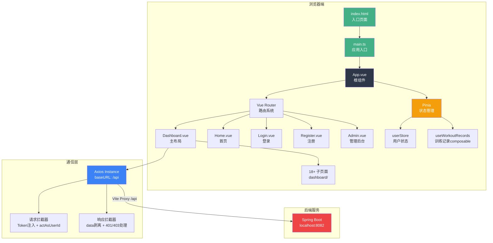
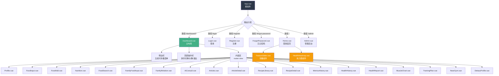
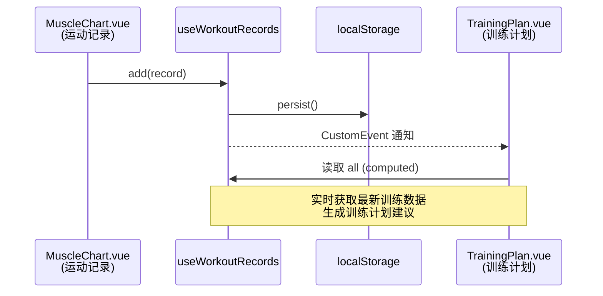
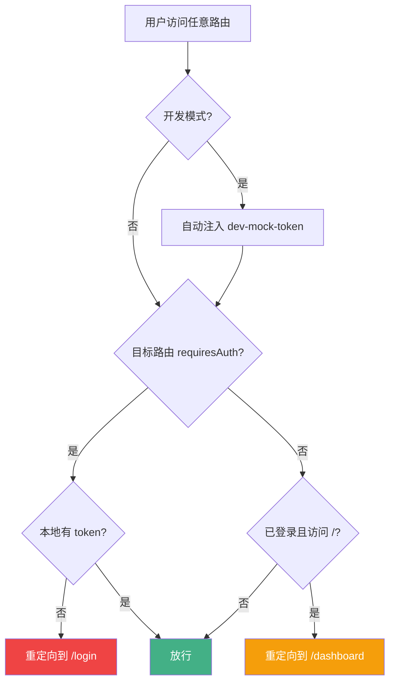
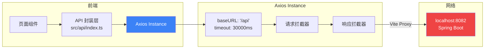
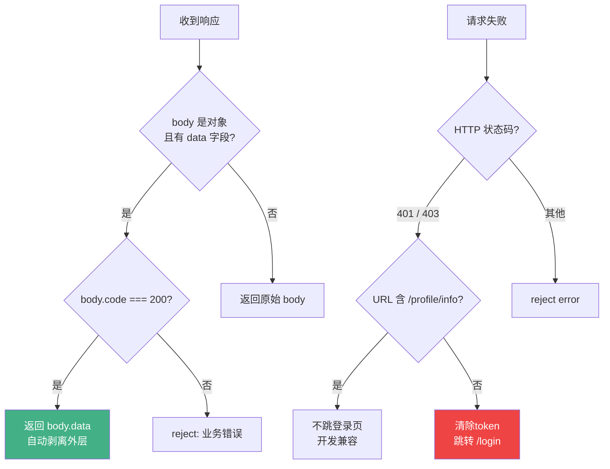
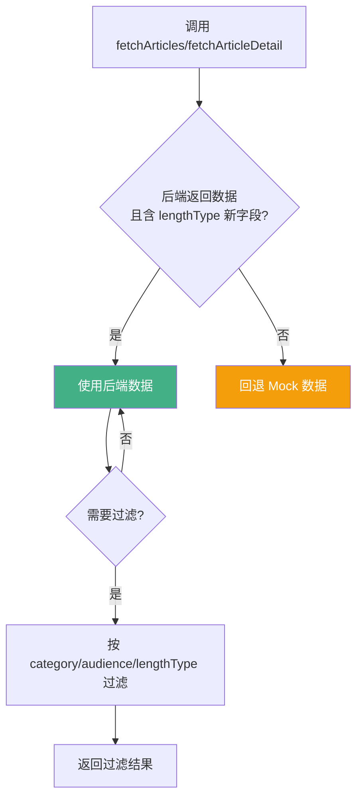
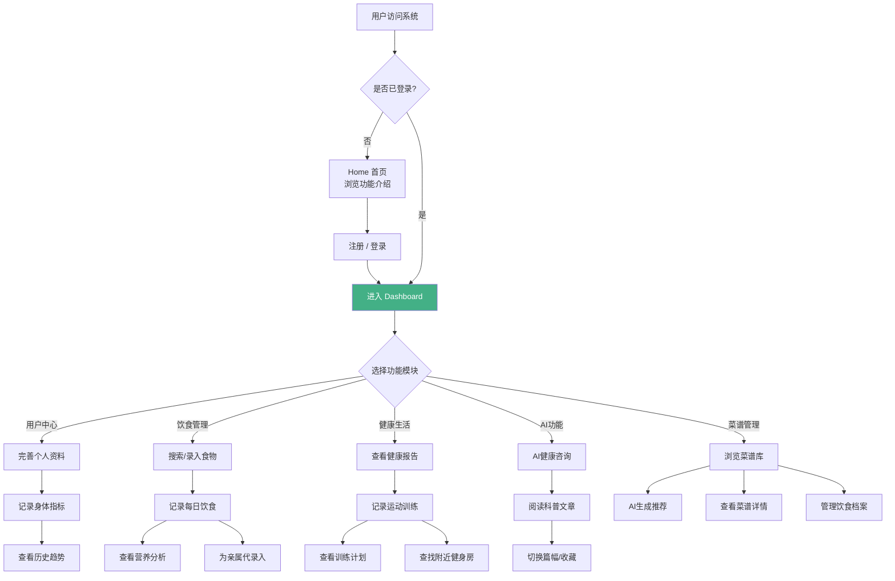
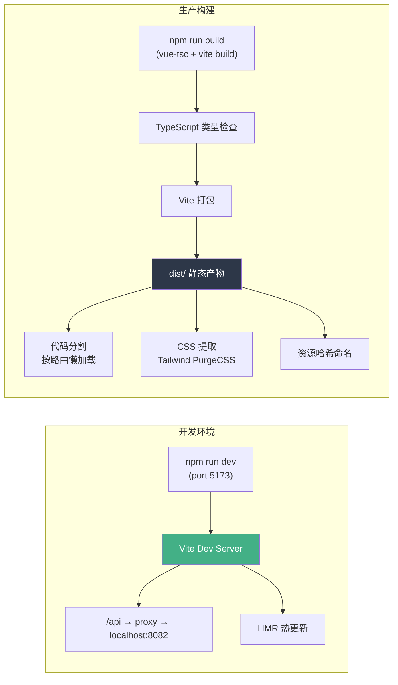

# 前端应用架构设计文档

## 个人健康管理系统（HealthManage）

---

## 1. 整体架构设计

### 1.1 架构概述

本系统采用 **SPA（Single Page Application）单页面应用架构**，基于 **Vue 3 + Vite + TypeScript** 技术栈构建。应用通过 **Hash 路由** 实现页面间的无刷新切换，所有前端资源经过 Vite 构建后形成静态产物，部署于 Nginx 或 CDN，与后端 Java 服务通过 `/api` 前缀的 RESTful 接口通信。

### 1.2 架构全景图



### 1.3 源代码目录结构

```
frontend-health/
├── index.html                    # HTML 入口，加载 Inter 字体 + 高德地图安全密钥
├── package.json                  # 项目依赖与脚本
├── vite.config.ts                # Vite 构建配置（代理、别名、测试）
├── tsconfig.json                 # TypeScript 配置
├── tailwind.config.js            # Tailwind CSS 主题扩展
├── postcss.config.js             # PostCSS 配置
├── public/                       # 静态资源（图片等）
│   └── images/
└── src/
    ├── main.ts                   # 应用入口：挂载 Vue + Pinia + Router
    ├── App.vue                   # 根组件：全局柔光背景 + 路由视图 + 导航栏
    ├── styles.css                # 全局样式：Tailwind 指令 + 毛玻璃/渐变/动画
    ├── api/
    │   ├── index.ts              # Axios 实例 + 完整 API 端点定义
    │   └── articleMock.ts        # 科普文章 Mock 数据（12篇 × 3篇幅）
    ├── assets/
    │   └── style/
    │       └── tailwind.css      # 全局底层氛围背景 + 呼吸柔光动画
    ├── components/
    │   ├── FeatureSlider.vue     # 通用卡片轮播组件
    │   └── HealthHeatmap.vue     # 健康数据热力图组件
    ├── composables/
    │   └── useWorkoutRecords.ts  # 训练记录共享状态（跨页面通信）
    ├── config/
    │   └── menus.ts              # 侧边栏五级菜单配置
    ├── data/
    │   └── exercises.ts          # 55+ 健身动作静态数据（MET值、步骤、提示）
    ├── router/
    │   └── index.ts              # Hash 路由配置 + 导航守卫
    ├── stores/
    │   └── user.ts               # Pinia 用户Store（登录/注册/亲属管理）
    ├── views/
    │   ├── Home.vue              # 营销首页（Hero + 轮播 + Feature展示）
    │   ├── Login.vue             # 登录页
    │   ├── Register.vue          # 注册页
    │   ├── ForgotPassword.vue    # 忘记密码
    │   ├── Dashboard.vue         # 主布局（侧边栏 + 顶栏 + 内容区）
    │   ├── Admin.vue             # 管理后台
    │   └── dashboard/            # 18+ 业务功能页面
    │       ├── Profile.vue           # 个人中心
    │       ├── FoodInput.vue         # 录入饮食
    │       ├── FoodAdd.vue           # 添加食材
    │       ├── FoodSearch.vue        # 食物搜索
    │       ├── Nutrition.vue         # 营养分析
    │       ├── FamilyFoodInput.vue   # 亲属代录入饮食
    │       ├── FamilyRelation.vue    # 亲属关系管理
    │       ├── AiConsult.vue         # AI健康咨询（含快捷问题+AI智能功能）
    │       ├── DietaryProfile.vue    # 饮食档案管理
    │       ├── Articles.vue          # 科普文章列表
    │       ├── ArticleDetail.vue     # 科普文章详情（三档篇幅切换）
    │       ├── RecipeLibrary.vue     # 菜谱库
    │       ├── RecipeDetail.vue      # 菜谱详情
    │       ├── MetricsHistory.vue    # 身体指标历史
    │       ├── HealthHistory.vue     # 健康档案历史
    │       ├── HealthReport.vue      # 健康报告
    │       ├── MuscleChart.vue       # 运动记录
    │       ├── TrainingPlan.vue      # 训练计划
    │       ├── NearGym.vue           # 附近地图（高德）
    │       └── IconGallery.vue       # 图标展示（开发辅助）
    └── __tests__/                # 单元测试
        ├── setup.ts
        ├── api/index.test.ts
        ├── router/index.test.ts
        └── stores/user.test.ts
```

---

## 2. 技术栈

| 分类 | 技术选型 | 版本 | 用途 |
|------|---------|------|------|
| **框架** | Vue 3 | ^3.3.4 | Composition API 驱动的响应式 UI 框架 |
| **构建工具** | Vite | ^4.4.9 | 极速开发服务器 + 生产构建 |
| **语言** | TypeScript | ^5.2.2 | 类型安全、IDE 智能提示 |
| **路由** | Vue Router | ^4.2.4 | Hash 模式 SPA 路由 |
| **状态管理** | Pinia | ^2.1.6 | 轻量级全局状态管理 |
| **HTTP 客户端** | Axios | ^1.5.0 | RESTful API 通信 |
| **UI 样式** | Tailwind CSS | ^3.4.19 | Utility-first 原子化 CSS |
| **图标库** | Lucide Vue Next | ^1.0.0 | 轻量 SVG 图标组件 |
| **图表** | ECharts | ^5.6.0 | 数据可视化（营养分析、指标趋势） |
| **地图** | @amap/amap-jsapi-loader | ^1.0.1 | 高德地图（附近健身房/场所） |
| **肌肉图** | body-muscles | ^1.0.0 | 人体肌肉群可视化 |
| **测试** | Vitest | ^4.1.10 | 单元测试框架 |
| **测试工具** | @vue/test-utils | ^2.4.11 | Vue 组件测试 |
| **CSS 后处理** | PostCSS + Autoprefixer | — | CSS 前缀自动补全 |

---

## 3. 组件结构与状态管理方案

### 3.1 组件层级树



### 3.2 状态管理方案

项目采用 **Pinia** 作为全局状态管理方案，结合 **Composable** 模式实现模块级共享状态。

#### 3.2.1 Pinia Store —— `useUserStore`

定义于 `src/stores/user.ts`，管理以下状态：

| 状态字段 | 类型 | 说明 |
|---------|------|------|
| `user` | `User \| null` | 当前登录用户信息（用户名、角色、身体数据、token） |
| `wards` | `Array` | 被监护人列表（亲属关系） |
| `actAsUserId` | `number \| null` | 当前替谁操作（`null` = 操作自己） |

**核心 Actions：**

| 方法 | 说明 |
|------|------|
| `login(username, password)` | 登录 → 存 token → 加载亲属列表 |
| `register(data)` | 注册新用户 |
| `init()` | 应用初始化：从 localStorage 恢复登录态，调 `/profile/info` 拉取资料 |
| `logout()` | 清除所有本地状态和 token |
| `loadWards()` | 加载监护人下的亲属列表 |
| `loadUserProfile()` | 刷新当前用户资料 |
| `setActAs(userId)` | 切换操作身份（自己/亲属） |

**核心 Getters：**

| Getter | 说明 |
|--------|------|
| `isLoggedIn` | 是否已登录 |
| `isAdmin` | 是否管理员 |
| `activeUserId` | 当前实际操作对象的 userId |
| `activeUserLabel` | 当前操作身份显示文本（如"替 张三 操作"） |

#### 3.2.2 Composable —— `useWorkoutRecords`

定义于 `src/composables/useWorkoutRecords.ts`，以 **模块级单例 ref** 实现跨 `MuscleChart.vue` 和 `TrainingPlan.vue` 的训练数据共享：



#### 3.2.3 状态持久化策略

| 数据 | 存储位置 | 说明 |
|------|---------|------|
| `user_token` / `token` | localStorage | JWT Token |
| `currentUserId` | localStorage | 当前登录用户 ID |
| `actAsUserId` | localStorage | 亲属代操作目标 ID |
| `workout_records` | localStorage | 训练记录 JSON 数组 |

---

## 4. 路由设计与导航体系

### 4.1 路由架构

系统使用 **Hash 路由模式**（`createWebHashHistory`），路径格式为 `/#/dashboard/profile`。

```mermaid
graph LR
    subgraph 公开路由
        R1["/ → Home.vue"]
        R2["/login → Login.vue"]
        R3["/register → Register.vue"]
        R4["/forgot-password → ForgotPassword.vue"]
    end

    subgraph 需认证路由
        R5["/admin → Admin.vue"]
        R6["/dashboard → Dashboard.vue<br/>(父路由，redirect → profile)"]
    end

    subgraph Dashboard子路由["/dashboard/* 子路由 (18个)"]
        S1["profile (默认)"]
        S2["food-input"]
        S3["food-add"]
        S4["nutrition"]
        S5["food-search"]
        S6["family-input"]
        S7["ai-consult"]
        S8["training-plan"]
        S9["gym"]
        S10["family-relation"]
        S11["metrics-history"]
        S12["health-history"]
        S13["recipe-library"]
        S14["recipe-detail/:id"]
        S15["dietary-profile"]
        S16["health-report"]
        S17["muscle-chart"]
        S18["articles"]
        S19["article-detail/:id"]
        S20["icon-gallery (dev)"]
    end

    R6 --> Dashboard子路由

    style R6 fill:#43b086,color:#fff
```



### 4.2 路由导航守卫（Router Guard）



关键守卫逻辑：

1. **开发模式自动登录**：`import.meta.env.DEV` 时自动注入 `dev-mock-token`，无需手动登录即可预览所有页面。
2. **需要认证的路由**：`/dashboard/*` 和 `/admin`，无 token 时跳转登录页。
3. **已登录用户访问首页**：自动跳转 `/dashboard`，避免两个导航栏叠加。
4. **路由切换滚动行为**：始终滚动到页面顶部（`scrollBehavior: { top: 0 }`）。

### 4.3 历史路由兼容（Redirects）

系统通过重定向兼容已废弃的路由：

| 旧路由 | 重定向到 | 原因 |
|--------|---------|------|
| `/dashboard/ai-chat` | `/dashboard/ai-consult` | AI对话助手合并到AI健康咨询 |
| `/dashboard/feature-hub` | `/dashboard/profile` | 功能中心合并到个人中心 |
| `/dashboard/health-education` | `/dashboard/articles` | 健康教育合并到科普文章 |
| `/dashboard/recipe-search` | `/dashboard/recipe-library` | 菜谱搜索合并到菜谱库 |
| `/dashboard/community` | `/dashboard/profile` | 社区交流功能移除 |

### 4.4 导航菜单体系（Config-Driven）

菜单配置集中在 `src/config/menus.ts`，采用 **两级菜单结构**，数据驱动渲染 Dashboard 左侧边栏：

| 一级菜单 | 图标 | 主题色 | 二级子菜单 |
|---------|------|--------|-----------|
| **用户中心** | User | `#43b086` | 个人中心、身体指标历史、健康档案历史、亲属关系管理 |
| **饮食管理** | UtensilsCrossed | `#f59e0b` | 录入饮食、添加食材、营养分析、食物搜索、亲属代录入饮食 |
| **菜谱管理** | ChefHat | `#ef4444` | 菜谱库、饮食档案管理 |
| **健康生活** | Activity | `#3b82f6` | 健康报告、附近地图、运动记录 |
| **AI功能** | Bot | `#8b5cf6` | AI健康咨询、训练计划、科普文章 |

---

## 5. 前端与后端的通信方式

### 5.1 Axios 实例配置



### 5.2 请求拦截器 —— Token 注入 + 亲属代操作

每次请求自动执行：

1. 从 `localStorage` 读取 `user_token` 或 `token`，注入 `Authorization: Bearer <token>` 请求头
2. 检测当前是否为"替亲属操作"模式（`actAsUserId != null` 且 `actAsUserId != currentUserId`）：
   - GET 请求：自动附加 `targetUserId` 到 `params`
   - 其他请求：自动附加 `targetUserId` 到 URL 查询字符串

这使得所有 API 调用无需手动传递被操作人 ID，后端根据 `targetUserId` 参数返回对应亲属的数据。

### 5.3 响应拦截器 —— 数据剥离 + 401/403 处理



关键特性：

- **自动剥离 data**：后端统一响应格式 `{ code: 200, data: {...} }`，拦截器自动提取 `data` 字段，前端组件直接拿到业务数据
- **业务状态码检查**：`code !== 200` 时，拦截器将其转为 Promise rejection，由调用方 `catch` 处理
- **开发兼容**：`/profile/info` 的 403 不触发跳转，避免 dev 模式下 mock token 无法预览页面

### 5.4 API 端点全景

API 按业务领域分为 **10 个模块**：

| 模块 | 路径前缀 | 端点数量 | 说明 |
|------|---------|---------|------|
| `auth` | `/auth/*` | 3 | 登录、注册、重置密码 |
| `food` | `/food/*` | 7 | 食物 CRUD、搜索、分类、审核 |
| `diet` | `/diet/*` | 4 | 饮食记录增删查、营养分析 |
| `profile` | `/profile/*` | 4 | 个人信息、饮食档案、数据快照 |
| `admin` | `/admin/*` | 9 | 用户管理、食物管理、统计 |
| `report` | `/report/*` | 5 | 健康报告增删查 |
| `relation` | `/relation/*` | 7 | 亲属关系管理（添加/确认/拒绝/移除） |
| `metrics` | `/metrics/*` | 4 | 身体指标历史 CRUD |
| `ai` | `/ai/*` | 11 | AI咨询、菜谱生成、营养分析、食物审核、语音解析、周报、文章生成、膳食计划、菜谱推荐、运动建议、饮食解析 |
| `recipe` | `/recipes/*` | 9 | 菜谱 CRUD、搜索、收藏 |
| `article` | `/articles/*` | 10 | 科普文章 CRUD、搜索、分类、AI生成、关联文章 |

### 5.5 SSE 流式处理（AI 咨询）

`AiConsult.vue` 中的 AI 健康咨询功能通过 **POST 请求 + 流式响应** 实现，后端返回分块数据，前端逐步渲染 AI 回复内容，提供实时对话体验。

> 注：具体 SSE 实现细节在 `AiConsult.vue` 组件内部通过 Axios 的 `responseType: 'stream'` 或原生 `fetch` + `ReadableStream` 处理。

### 5.6 Mock 兜底机制

`src/api/articleMock.ts` 实现了 **后端优先、失败回退 Mock** 的数据获取模式：



- 科普文章：12 篇 Mock 数据（4 主题 × 3 篇幅），覆盖补钙、减盐、健身蛋白质、肠道健康四大场景
- 每篇文章支持三种篇幅：**速读卡**（~300字）、**深度文**（~1500字）、**综述文**（~2500字）

---

## 6. 用户交互流程与界面设计原则

### 6.1 核心用户流程



### 6.2 页面过渡动画

| 动画类型 | 实现方式 | 应用场景 |
|---------|---------|---------|
| **路由切换淡入淡出** | `<transition name="fade" mode="out-in">` | App.vue 中所有路由视图切换 |
| **页面进入动画** | `page-fade-in` CSS 类（0.8s） | 独立页面（Login、Register、Home） |
| **内容区淡入** | `content-fade` 动画（0.3s） | Dashboard 子页面切换 |
| **滚动渐入** | `scroll-reveal` + IntersectionObserver | 首页各区块滚动进入 |
| **全局呼吸柔光** | `ambient-glow` + keyframes 动画（9s/11s 周期） | App.vue 根层固定背景 |

### 6.3 界面设计原则

#### 6.3.1 色彩体系（Morandi 风格）

项目以 **Morandi（莫兰迪）色系** 为核心设计语言，通过 Tailwind CSS 自定义主题实现：

| 颜色变量 | 色值 | 用途 |
|---------|------|------|
| `morandi-gray` | `#f4f5f7` | 页面背景灰 |
| `morandi-soft` | `#e8eaee` | 边框、分隔线、hover 背景 |
| `morandi-text` | `#2d3748` | 主要文字 |
| `morandi-lightText` | `#718096` | 次要文字、描述 |
| `morandi-accent` | `#43b086` | 主题强调色（按钮、选中态、高亮） |

全局背景为 `linear-gradient(135deg, #e8f5f0, #e3f2fd, #f0f9f4, #ecf5fb)` 四色渐变。

#### 6.3.2 视觉风格关键词

- **毛玻璃效果**（Glassmorphism）：`glass` 工具类（`rgba(255,255,255,0.75)` + `backdrop-filter: blur(10px)`）
- **悬浮外发光**：`glow-card` / `glow-btn` 工具类，hover 时产生绿色柔光阴影
- **呼吸柔光**：页面底层两个固定定位的径向渐变圆形，以 9s/11s 周期缓慢缩放移动
- **大圆角**：卡片使用 `rounded-2xl`（16px），按钮使用 `rounded-xl`（12px）

#### 6.3.3 字体系统

- 主字体：**Inter**（Google Fonts），权重覆盖 300/400/500/600/700
- 后备字体：`-apple-system, BlinkMacSystemFont, 'Segoe UI', Roboto, sans-serif`
- 大标题使用 `font-bold + tracking-tight`
- 正文使用 `text-sm` 或 `text-base` + `leading-relaxed`

#### 6.3.4 响应式设计

| 断点 | 布局策略 |
|------|---------|
| 移动端 (< 768px) | 隐藏顶部导航菜单项；侧边栏收缩或覆盖；单列布局 |
| 平板端 (768px - 1024px) | 两列网格布局；侧边栏保持可见 |
| 桌面端 (> 1024px) | 三列网格（如 AI 咨询页）；侧边栏 256px 固定宽度 |

响应式通过 Tailwind 断点前缀（`md:`、`lg:`）实现，无需额外 CSS 媒体查询。

---

## 7. 构建与部署

### 7.1 Vite 配置



关键配置：

- **路径别名**：`@` → `src/`，简化导入路径
- **开发代理**：`/api` → `http://localhost:8082`（后端 Spring Boot）
- **测试环境**：`happy-dom`（轻量 DOM 模拟）

### 7.2 代码分割策略

所有 Dashboard 子页面均使用 **动态 import**（`() => import('@/views/dashboard/...')`），Vite 自动将每个页面拆分为独立 chunk：

- `Admin.vue` → `Admin-[hash].js` + `Admin-[hash].css`
- `AiConsult.vue` → `AiConsult-[hash].js` + `AiConsult-[hash].css`
- 每个页面独立加载，减少首屏体积

Lucide 图标也按需拆分为独立 chunk（如 `user-[hash].js`、`dumbbell-[hash].js`），避免全量图标库加载。

---

## 8. 测试策略

项目使用 **Vitest** 作为测试框架，测试文件位于 `src/__tests__/`：

| 测试文件 | 测试内容 |
|---------|---------|
| `api/index.test.ts` | Axios 实例创建、拦截器行为、API 端点定义 |
| `router/index.test.ts` | 路由注册、导航守卫逻辑、重定向规则 |
| `stores/user.test.ts` | userStore 状态变更、登录/登出逻辑、亲属切换 |
| `setup.ts` | 测试环境初始化（mock localStorage 等） |

---

## 9. 架构设计原则总结

| 原则 | 实现方式 |
|------|---------|
| **关注点分离** | API 层、状态层、视图层清晰分离；config 驱动菜单 |
| **懒加载优先** | 所有子路由使用动态 import；图标按需加载 |
| **渐进增强** | Mock 兜底 → 后端优先；开发模式自动登录 |
| **状态持久化** | localStorage 存储 token + 训练记录 + 操作身份 |
| **亲属代操作** | 统一的 `actAsUserId` 机制，请求拦截器自动附加 `targetUserId` |
| **类型安全** | TypeScript strict 模式 + 接口定义（User/Article/WorkoutRecord 等） |
| **用户体验** | 路由过渡动画 + 滚动渐入 + 呼吸柔光背景 + 毛玻璃卡片 |
| **可维护性** | 菜单配置与视图解耦；统一 API 端点管理；Composable 复用逻辑 |
