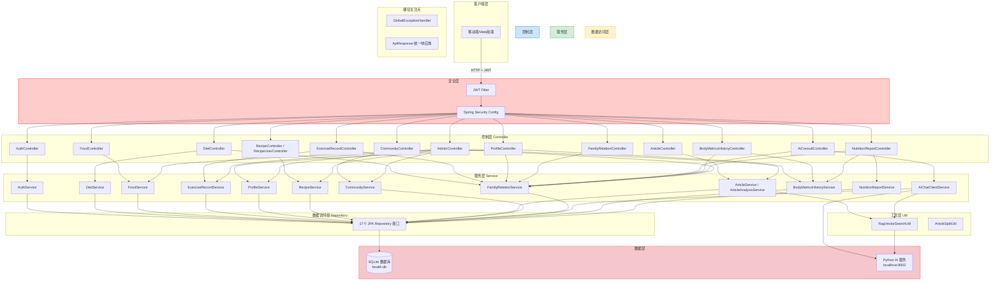
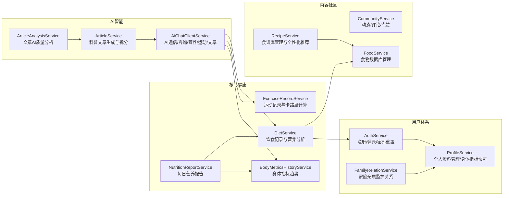
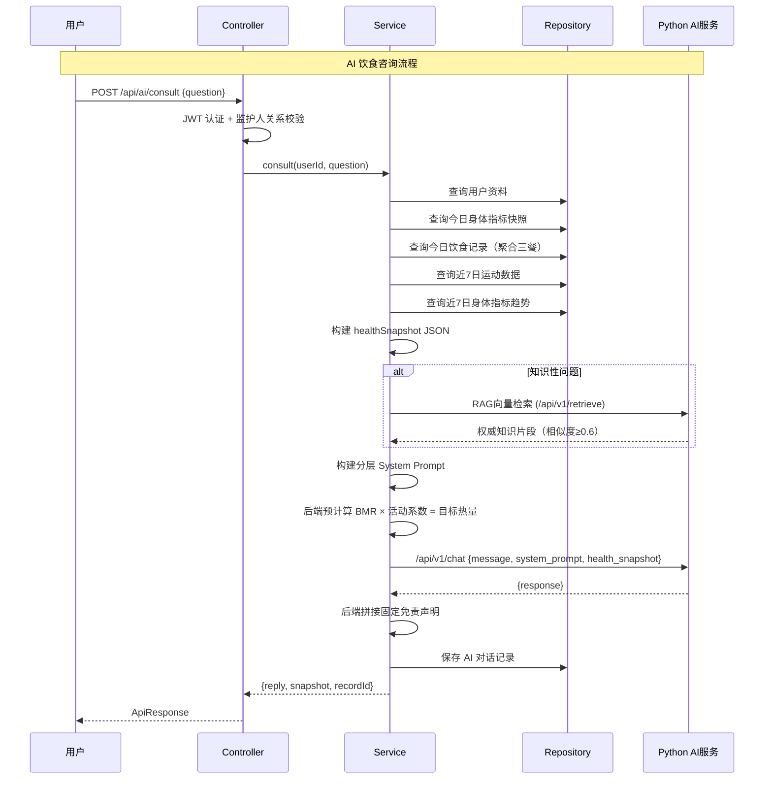
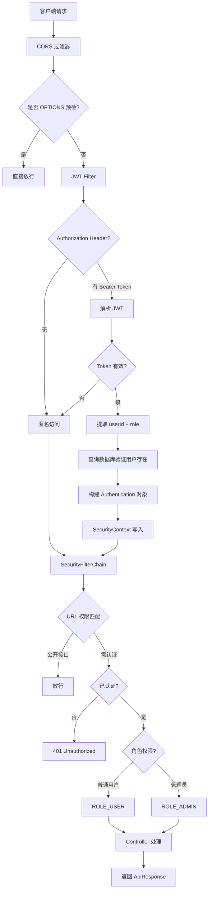
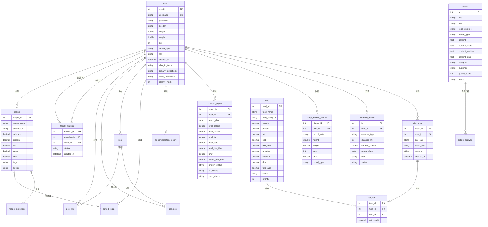

# 个人健康助手 - 后端系统架构设计文档

---

## 1. 整体架构设计

### 1.1 分层架构

本系统采用经典的 **三层分层架构**（Controller → Service → Repository），结合 Spring Boot 自动装配和 JPA/Hibernate ORM 框架，构建了一个清晰、可维护的个人健康管理后端。



### 1.2 核心设计原则

| 原则 | 体现 |
|------|------|
| **单一职责** | 每个 Controller 仅处理一个业务模块的请求路由；每个 Service 封装单一业务逻辑 |
| **依赖倒置** | Controller 依赖 Service 接口，Service 依赖 Repository 接口，通过构造器注入解耦 |
| **分层隔离** | 控制层不直接操作数据库，服务层不处理 HTTP 请求/响应格式 |
| **统一响应** | 所有接口使用 `ApiResponse<T>` 统一包装 `{code, message, data}` |
| **全局异常处理** | `GlobalExceptionHandler` 兜底所有未捕获异常，避免 500 空白页 |

---

## 2. 技术栈总览

| 分类 | 技术/框架 | 版本 | 说明 |
|------|-----------|------|------|
| 基础框架 | Spring Boot | 2.7.18 | 主框架，自动装配 + 嵌入式 Tomcat |
| 安全框架 | Spring Security | 5.7.x（随 Boot 2.7） | 认证与授权 |
| 认证机制 | JWT（jjwt） | 0.9.1 | 无状态 Token 认证 |
| 持久层 | Spring Data JPA + Hibernate | 5.6.x（随 Boot 2.7） | ORM 框架，DDL 自动管理 |
| 数据库 | SQLite | 3.42.0.0（sqlite-jdbc） | 嵌入式关系型数据库 |
| SQLite方言 | sqlite-dialect (gwenn) | 0.1.2 | Hibernate SQLite 方言适配 |
| 密码加密 | BCryptPasswordEncoder | Spring Security 内置 | 密码哈希存储 |
| JSON序列化 | Jackson | 随 Spring Boot | RESTful JSON |
| 参数校验 | spring-boot-starter-validation | 随 Boot 2.7 | Bean Validation |
| 简化代码 | Lombok | 随 Boot 2.7 | 减少样板代码 |
| HTTP客户端 | RestTemplate | Spring 内置 | 调用 Python AI 服务 |
| 测试 | JUnit 4 + Mockito | 4.x / 5.x | 单元测试 |
| 运行环境 | Java 8 | 1.8 | 编译目标 |
| 构建工具 | Maven | 3.x | 依赖管理 |

---

## 3. 各服务组件的设计与职责

### 3.1 服务组件全景



### 3.2 各核心服务详细职责

#### 3.2.1 AuthService（认证服务）
- **注册**：校验用户名唯一性、密码长度 ≥ 6 位，BCrypt 加密后存储，返回 JWT Token
- **登录**：密码匹配验证，签发 JWT Token（含 userId、username、role）
- **密码重置**：用户名校验，新密码加密更新

#### 3.2.2 DietService（饮食服务）
- **餐次管理**：添加/删除一日三餐及加餐（早餐、午餐、晚餐、加餐）
- **营养汇总**：按日期聚合所有餐次，计算每餐及全天营养素（热量/蛋白质/脂肪/碳水/膳食纤维/钙/DHA/叶酸）
- **营养分析**：
  - 基于用户体重计算 BMR（Mifflin-St Jeor 公式）
  - 根据人群类型（健身/青少年/老年人/孕妇/糖尿病）匹配不同营养素推荐值
  - 自动计算各营养素达标状态（low/normal/high）与健康风险警告

#### 3.2.3 ExerciseRecordService（运动服务）
- **运动记录**：记录运动类型、时长，基于 MET 值自动计算卡路里消耗
- **MET 卡路里公式**：`消耗热量 = MET × 3.5 × 体重(kg) × 时长(min) / 200`
- **统计分析**：今日统计、本周统计、日期范围统计
- **内容审核**：运动记录支持审核状态（approved/pending/rejected）

#### 3.2.4 AI 智能服务（AiChatClientService 等 6 类）⭐ 核心
> 原单体 `AiChatService` 已按业务域拆分为 6 个组件：`AiChatClientService`（HTTP 通信）、`AiChatContextBuilder`（上下文组装）、`AiConsultService`（咨询/SSE）、`AiNutritionService`（营养）、`AiExerciseService`（运动）、`AiContentService`（文章/周报）；熔断由独立组件 `CircuitBreaker`（@Component 单例，全局共享）统一管理。
- **AI 饮食咨询**：构建用户健康数据快照（身体指标 + 运动数据 + 饮食记录 + 指标趋势），调用 Python AI 服务
- **分层 Prompt 架构**（v2.1）：
  - 固定系统指令：专业角色设定、硬性规则
  - 动态用户数据：用户资料、今日身体指标、近 7 日趋势、今日饮食、近 7 日运动
  - 后端预计算目标值：BMR × 活动系数 = 每日目标热量，AI 禁止自行计算
  - RAG 向量知识库注入：知识性问题时注入 BGE 检索结果
- **语音解析**：NLP 语音转结构化饮食数据
- **食物AI审核**：用户提交自定义食物时自动审核营养成分合理性
- **食谱生成**：根据用户画像动态生成个性化食谱 JSON
- **膳食计划优化**：综合身体+运动数据生成三餐营养分配方案
- **运动建议**：基于用户特征和运动目标生成个性化运动方案

#### 3.2.5 ProfileService（用户资料服务）
- **基本资料管理**：身高、体重、年龄、性别、人群类型
- **饮食档案管理**：过敏食材、饮食限制、口味偏好、老年模式
- **BMI 计算**：`体重(kg) / (身高(m))²`，自动判定偏瘦/正常/超重/肥胖
- **BMR 计算**：Mifflin-St Jeor 公式，男女分别计算
- **身体指标快照**：更新资料时自动写一份快照到 `body_metrics_history` 表（同一天覆盖）

#### 3.2.6 FamilyRelationService（亲属关系服务）
- **监护邀请**：监护人发起 → 待确认 → 被监护人确认/拒绝
- **状态流转**：`pending` → `confirmed` / `rejected`
- **双向禁止**：防止 A 监护 B 的同时 B 监护 A
- **数据代理**：已确认的监护人可以查看/操作被监护人的饮食、运动、身体指标数据

#### 3.2.7 RecipeService（食谱服务）
- **食谱库管理**：创建/更新/删除/搜索食谱
- **食材替代**：根据用户过敏食材和饮食限制，智能推荐替换食材
- **多标签分类**：孕妇/糖尿病/老年人/青少年/高血压/减脂/健身等
- **用户收藏**：保存我的食谱、管理收藏列表

#### 3.2.8 ArticleService（科普文章服务）
- **AI 生成**：主题 + 人群类型 → AI 生成母稿 → 拆分三版（速读卡/深度文/综述文）→ 校验 → 入库
- **母稿导入**：支持外部 Pipeline 生成的母稿 → 复用后端拆分逻辑
- **自纠错进化**：AI 分析文章质量问题 → 注入提示词 → 重新生成，形成闭环迭代
- **知识库自学习**：管理员手动/联网获取权威资料 → 向量化入库
- **RAG 混合架构生成**（方案C）：前置 BGE 向量检索 → 资料搜集 Agent → 撰写母稿 → 事实校验 Agent → 失败重试 → 拆分入库
- **素材热度统计**：帮助管理员识别知识缺口，定向补充文档

#### 3.2.9 CommunityService（社区服务）
- **动态发布**：支持带标签的图文动态（标签：饮食分享/运动打卡/健康知识等）
- **评论互动**：动态下评论，级联管理
- **点赞模块**：独立 `post_like` 表，toggle 模式（点一次赞，再点取消）
- **审核机制**：动态和评论均支持 approved/pending/rejected 三态审核

### 3.3 跨服务协作关系

```
AdminController (统一管理入口)
    ├── 用户管理    → ProfileService + FamilyRelationService
    ├── 食物审核    → FoodService
    ├── 运动审核    → ExerciseRecordService
    ├── 食谱管理    → RecipeService
    ├── 社区审核    → CommunityService
    └── 文章管理    → ArticleService + ArticleAnalysisService

家庭监护代理模式（多Controller共享）:
    resolveOperateUserId(currentUserId, targetUserId)
        ├── targetUserId 为空或等于自己 → 操作本人数据
        ├── 是已确认监护人 → 代理操作被监护人数据
        └── 否 → 返回 403 Forbidden
```

---

## 4. 数据流转流程与接口设计

### 4.1 RESTful API 列表

#### 4.1.1 认证模块 `/api/auth`（公开接口）

| 方法 | 路径 | 说明 | 认证 |
|------|------|------|------|
| POST | `/api/auth/register` | 用户注册 | 无 |
| POST | `/api/auth/login` | 用户登录 | 无 |
| POST | `/api/auth/reset-password` | 重置密码 | 无 |

#### 4.1.2 饮食模块 `/api/diet`（需认证）

| 方法 | 路径 | 说明 | 参数 |
|------|------|------|------|
| POST | `/api/diet/add` | 添加一餐 | body: AddMealRequest, ?targetUserId |
| DELETE | `/api/diet/meal/{mealId}` | 删除一餐 | ?targetUserId |
| GET | `/api/diet/date/{date}` | 按日期查餐次 | ?targetUserId |
| GET | `/api/diet/analyze/{date}` | 营养分析 | ?targetUserId |

#### 4.1.3 食物模块 `/api/food`

| 方法 | 路径 | 说明 | 认证 |
|------|------|------|------|
| GET | `/api/food/search` | 搜索食物 | 公开 |
| GET | `/api/food/list` | 全部食物列表 | 公开 |
| GET | `/api/food/category/{category}` | 按分类查询 | 需认证 |
| GET | `/api/food/{foodId}` | 食物详情 | 需认证 |
| POST | `/api/food/batch-lookup` | 批量查询 | 需认证 |
| POST | `/api/food/add` | 提交新食物 | 需认证 |
| GET | `/api/food/pending` | 待审核食物 | 管理员 |
| POST | `/api/food/approve/{foodId}` | 审核通过 | 管理员 |
| POST | `/api/food/reject/{foodId}` | 审核拒绝 | 管理员 |

#### 4.1.4 运动模块 `/api/exercise`（需认证）

| 方法 | 路径 | 说明 |
|------|------|------|
| GET | `/api/exercise/types` | 运动类型列表（公开） |
| POST | `/api/exercise/add` | 添加运动记录 |
| POST | `/api/exercise/add-with-date` | 指定日期添加运动 |
| GET | `/api/exercise/records` | 运动记录列表 |
| GET | `/api/exercise/records/today` | 今日运动记录 |
| GET | `/api/exercise/records/range` | 日期范围查询 |
| GET | `/api/exercise/stats/today` | 今日运动统计 |
| GET | `/api/exercise/stats/week` | 本周运动统计 |
| DELETE | `/api/exercise/record/{id}` | 删除记录 |

#### 4.1.5 用户资料 `/api/profile`（需认证）

| 方法 | 路径 | 说明 |
|------|------|------|
| GET | `/api/profile/info` | 获取用户资料（含BMI/BMR） |
| PUT | `/api/profile/update` | 更新资料（含自动快照） |
| PUT | `/api/profile/dietary` | 更新饮食档案 |
| POST | `/api/profile/snapshot` | 手动保存身体指标快照 |

#### 4.1.6 身体指标 `/api/metrics`（需认证）

| 方法 | 路径 | 说明 |
|------|------|------|
| GET | `/api/metrics/history/{userId}` | 查询指标历史 |
| GET | `/api/metrics/history/{userId}/range` | 按日期范围查询 |
| POST | `/api/metrics/save` | 手动保存历史指标 |
| DELETE | `/api/metrics/delete` | 删除指定日期指标 |

#### 4.1.7 营养报告 `/api/report`（需认证）

| 方法 | 路径 | 说明 |
|------|------|------|
| POST | `/api/report/save` | 保存报告 |
| GET | `/api/report/date/{date}` | 按日期查报告 |
| GET | `/api/report/list` | 用户全部报告 |
| GET | `/api/report/range` | 日期范围查询 |
| DELETE | `/api/report/{reportId}` | 删除报告 |

#### 4.1.8 亲属关系 `/api/relation`（需认证）

| 方法 | 路径 | 说明 |
|------|------|------|
| POST | `/api/relation/add` | 发起监护邀请 |
| POST | `/api/relation/confirm/{relationId}` | 确认邀请 |
| POST | `/api/relation/reject/{relationId}` | 拒绝邀请 |
| GET | `/api/relation/my-wards` | 我监护的人 |
| GET | `/api/relation/my-guardians` | 监护我的人 |
| GET | `/api/relation/pending-invitations` | 待处理邀请 |
| DELETE | `/api/relation/{relationId}` | 删除关系 |

#### 4.1.9 AI 智能模块 `/api/ai`（需认证）

| 方法 | 路径 | 说明 |
|------|------|------|
| POST | `/api/ai/consult` | AI 饮食咨询 |
| POST | `/api/ai/voice/parse` | 语音解析 |
| POST | `/api/ai/nutrition/analyze` | AI 营养分析 |
| POST | `/api/ai/food/audit` | AI 食物审核 |
| POST | `/api/ai/report/weekly` | 生成周报 |
| POST | `/api/ai/meal/parse` | 饮食文本解析 |
| POST | `/api/ai/diet/plan` | 膳食计划优化 |
| POST | `/api/ai/generate-recipe` | AI 生成食谱 |
| POST | `/api/ai/recipe/recommend` | 菜谱推荐 |
| POST | `/api/ai/exercise/advice` | 运动建议 |
| POST | `/api/ai/article/generate` | AI 生成文章 |

#### 4.1.10 食谱模块 `/api/recipes`（GET公开，写操作需认证）

| 方法 | 路径 | 说明 |
|------|------|------|
| GET | `/api/recipes` | 搜索食谱 |
| GET | `/api/recipes/{recipeId}` | 食谱详情 |
| GET | `/api/recipes/{recipeId}/ingredients` | 食谱食材 |
| GET | `/api/recipes/{recipeId}/detail` | 食谱详情（含食材替代） |
| POST | `/api/recipes` | 创建食谱（需认证） |
| PUT | `/api/recipes/{recipeId}` | 更新食谱（需认证） |
| DELETE | `/api/recipes/{recipeId}` | 删除食谱（需认证） |

#### 4.1.11 用户食谱 `/api/recipe`（需认证）

| 方法 | 路径 | 说明 |
|------|------|------|
| GET | `/api/recipe/list` | 食谱列表 |
| GET | `/api/recipe/search` | 搜索 |
| GET | `/api/recipe/tag/{tag}` | 按标签筛选 |
| GET | `/api/recipe/{id}` | 详情 |
| GET | `/api/recipe/tags` | 标签列表 |
| GET | `/api/recipe/my-saved` | 我的收藏 |
| POST | `/api/recipe/save` | 收藏食谱 |
| DELETE | `/api/recipe/my-saved/{id}` | 取消收藏 |

#### 4.1.12 科普文章 `/api/articles`（GET公开，写操作需认证）

| 方法 | 路径 | 说明 |
|------|------|------|
| GET | `/api/articles` | 文章列表（可筛选） |
| GET | `/api/articles/latest` | 最新文章 |
| GET | `/api/articles/{id}` | 文章详情 |
| GET | `/api/articles/category/{category}` | 按分类 |
| GET | `/api/articles/topic/{topic}` | 按主题 |
| GET | `/api/articles/search` | 搜索 |
| GET | `/api/articles/categories` | 分类列表 |
| GET | `/api/articles/topics` | 主题列表 |
| GET | `/api/articles/related/{topicGroupId}` | 相关文章 |
| GET | `/api/articles/topic-group/{topicGroupId}` | 按主题组 |
| POST | `/api/articles` | 创建文章 |
| POST | `/api/articles/generate` | AI 生成三版文章 |
| POST | `/api/articles/generate-hybrid` | 混合架构生成 |
| POST | `/api/articles/generate-smart` | 统一生成（模式切换） |
| POST | `/api/articles/import-mother` | 导入母稿 |
| POST | `/api/articles/regenerate-with-correction/{articleId}` | 自纠错重新生成 |
| POST | `/api/articles/knowledge/ingest` | 知识库写入 |
| POST | `/api/articles/knowledge/acquire` | 联网获取权威资料 |
| GET | `/api/articles/knowledge/list` | 知识库列表 |
| GET | `/api/articles/knowledge/hot-stat` | 素材热度统计 |
| POST | `/api/articles/reset-demo` | 重置 Demo 数据 |

#### 4.1.13 社区模块 `/api/community`（需认证）

| 方法 | 路径 | 说明 |
|------|------|------|
| GET | `/api/community/posts` | 动态列表 |
| GET | `/api/community/posts/user/{userId}` | 某用户动态 |
| GET | `/api/community/post/{id}` | 动态详情 |
| POST | `/api/community/post/create` | 发布动态 |
| DELETE | `/api/community/post/{id}` | 删除动态 |
| GET | `/api/community/post/{id}/comments` | 评论列表 |
| POST | `/api/community/post/{id}/comment` | 添加评论 |
| DELETE | `/api/community/comment/{id}` | 删除评论 |
| POST | `/api/community/post/{id}/like` | 点赞/取消 |
| GET | `/api/community/post/{id}/is-liked` | 是否已点赞 |
| GET | `/api/community/tags` | 标签列表 |
| GET | `/api/community/posts/liked/{userId}` | 用户点赞动态 |
| GET | `/api/community/comments/user/{userId}` | 用户评论 |

#### 4.1.14 管理员模块 `/api/admin`（管理员专属）

| 方法 | 路径 | 说明 |
|------|------|------|
| GET | `/api/admin/users` | 全部用户 |
| GET | `/api/admin/users-with-relations` | 用户及亲属关系 |
| GET | `/api/admin/users/{userId}` | 用户详情 |
| DELETE | `/api/admin/users/{userId}` | 删除用户 |
| GET | `/api/admin/food/list` | 全部食物 |
| PUT | `/api/admin/food/update/{foodId}` | 更新食物 |
| DELETE | `/api/admin/food/{foodId}` | 删除食物 |
| POST | `/api/admin/food/approve/{foodId}` | 审核通过 |
| POST | `/api/admin/food/reject/{foodId}` | 审核拒绝 |
| GET | `/api/admin/stats/crowd-type` | 人群类型统计 |
| GET/POST/DELETE | `/api/admin/exercise-records/**` | 运动记录管理 |
| GET/POST/PUT/DELETE | `/api/admin/recipes/**` | 食谱库管理 |
| GET/POST/DELETE | `/api/admin/posts/**` | 动态审核管理 |
| GET/POST/DELETE | `/api/admin/comments/**` | 评论审核管理 |
| GET/PUT/DELETE | `/api/admin/articles/**` | 文章管理 |
| POST | `/api/admin/articles/{id}/analyze` | AI 文章质量分析 |
| POST | `/api/admin/articles/analyze-all` | 批量分析 |
| GET | `/api/admin/articles/{id}/analysis` | 最新分析 |
| GET | `/api/admin/articles/{id}/analysis-history` | 分析历史 |
| GET | `/api/admin/articles/low-quality` | 低质量文章 |
| GET | `/api/admin/articles/analysis-stats` | 分析统计 |

### 4.2 核心数据流程



### 4.3 统一响应格式

```json
{
    "code": 200,
    "message": "success",
    "data": { ... }
}
```

| code | 含义 |
|------|------|
| 200 | 成功 |
| 400 | 参数错误/业务异常 |
| 401 | 未登录/Token 无效 |
| 403 | 无权限（非监护人尝试操作他人数据） |
| 404 | 资源不存在 |
| 500 | 服务器内部错误 |
| 503 | AI 服务熔断中 |

---

## 5. 安全策略

### 5.1 安全架构总览



### 5.2 JWT 认证机制

**Token 生成**（JwtUtil）：
- 签名算法：**HS512**（HMAC-SHA512）
- Token 载荷（Claims）：
  - `sub`：用户 ID（字符串）
  - `username`：用户名
  - `role`：角色（user / admin）
  - `iat`：签发时间
  - `exp`：过期时间（24 小时 = 86400000 ms）
- 密钥：Base64 编码，配置于 `application.yml`

**Token 验证流程**（JwtFilter）：
1. 从请求头 `Authorization: Bearer <token>` 提取 Token
2. OPTIONS 预检请求直接放行
3. 调用 `jwtUtil.validateToken(token)` 校验签名和有效期
4. 从 Token 中提取 userId 和 role
5. 查询 `user` 表确认用户存在
6. 构建 `UsernamePasswordAuthenticationToken(user, null, [ROLE_xxx])`
7. 写入 `SecurityContextHolder`
8. 任何异常均被安全捕获，清除上下文后继续过滤链

### 5.3 Spring Security 配置

```yaml
安全策略配置 (SecurityConfig):
- CSRF: 关闭（RESTful API 无状态）
- Session: STATELESS（不创建 Session）
- CORS: 允许 localhost 所有端口
```

**访问控制矩阵**：

| URL 模式 | HTTP 方法 | 权限 |
|----------|-----------|------|
| `/api/auth/**` | ALL | 公开 |
| `/api/food/search` | GET | 公开 |
| `/api/food/list` | GET | 公开 |
| `/api/recipes/**` | GET | 公开 |
| `/api/recipes/**` | POST/PUT/DELETE | 需认证 |
| `/api/articles/**` | GET | 公开 |
| `/api/articles/**` | POST/PUT/DELETE | 需认证 |
| `/api/exercise/types` | GET | 公开 |
| `/api/admin/**` | ALL | ROLE_ADMIN |
| 其他所有 | ALL | 需认证 |

### 5.4 角色权限控制

| 角色 | 权限范围 |
|------|----------|
| **USER**（普通用户） | 管理自己的饮食/运动/资料/报告，社区发帖评论，AI 咨询，亲属监护 |
| **ADMIN**（管理员） | 全部普通用户权限 + 用户管理 + 食物审核/管理 + 运动审核 + 社区审核 + 食谱管理 + 文章管理/AI 质量分析 |

**方法级权限控制**：
```java
// 类级别
@RestController
@RequestMapping("/api/admin")
@PreAuthorize("hasRole('ADMIN')")  // 整个 AdminController 需要 ADMIN 角色
public class AdminController { ... }

// 方法级别
@GetMapping("/pending")
@PreAuthorize("hasRole('ADMIN')")  // 即使在 FoodController 中，部分方法也需 ADMIN
public ResponseEntity<ApiResponse<List<FoodDTO>>> getPendingFoods() { ... }
```

### 5.5 密码安全
- 存储：**BCrypt 加密**（Spring Security BCryptPasswordEncoder），不可逆
- 传输：密码仅在注册/登录时通过 HTTPS（生产环境）传输
- 验证：`passwordEncoder.matches(rawPassword, encodedPassword)`

### 5.6 全局安全防护

| 防护维度 | 实现 |
|----------|------|
| **异常信息屏蔽** | GlobalExceptionHandler 统一处理，不暴露堆栈信息 |
| **NullPointer 兜底** | NPE → 500 "服务器内部错误，请稍后重试" |
| **Runtime 异常** | → 400 BAD_REQUEST，返回异常 message |
| **AccessDenied** | → 403 "无权访问该资源，请检查权限" |
| **数据库密码** | 通过 BCrypt 加密存储 |
| **JWT 密钥** | 外置配置 `application.yml`，生产环境建议环境变量注入 |

---

## 6. 性能优化措施

### 6.1 RestTemplate 超时配置

```java
// AiChatClientService
private static final int CONNECT_TIMEOUT = 5000;   // 连接超时 5秒
private static final int READ_TIMEOUT    = 30000;  // 读取超时 30秒

SimpleClientHttpRequestFactory factory = new SimpleClientHttpRequestFactory();
factory.setConnectTimeout(CONNECT_TIMEOUT);
factory.setReadTimeout(READ_TIMEOUT);
this.restTemplate = new RestTemplate(factory);
```

```java
// RagVectorSearchUtil
private static final int CONNECT_TIMEOUT = 5000;   // 连接超时 5秒
private static final int READ_TIMEOUT    = 15000;  // 读取超时 15秒

// 知识获取（联网搜索）超时更宽松
factory.setReadTimeout(60000);   // 60秒
// Agent 联网搜索更宽松
factory.setReadTimeout(120000);  // 120秒
```

### 6.2 简单断路器（Circuit Breaker）

熔断由独立组件 `CircuitBreaker`（@Component 单例，全局共享熔断状态）实现：
```
连续失败 N 次 → 熔断打开（60秒内拒绝所有请求）
60 秒后 → 半开状态（尝试一次调用）
调用成功 → 熔断关闭，计数器重置
调用失败 → 熔断重新打开
```

**参数配置**：
- `CIRCUIT_BREAKER_THRESHOLD = 3`（连续失败 3 次触发熔断）
- `CIRCUIT_BREAKER_RESET_MS = 60000`（60 秒后尝试恢复）

**熔断时返回的友好提示**：
> ⚠️ AI 服务暂时熔断保护中（连续失败 3 次），请等待 XX 秒后重试。

**影响范围**：仅影响 `generateArticleMotherDraft()` 和 `callAiService()` 中通过 `/chat` 端点调用的请求。

### 6.3 SQLite 优化

| 优化措施 | 说明 |
|----------|------|
| **嵌入式部署** | 无需独立数据库服务器，零网络开销 |
| **单文件存储** | `./data/health.db` 单文件，备份迁移简单 |
| **WAL 模式** | SQLite 默认支持并发读，适合读多写少场景 |
| **JPA DDL-Auto** | `ddl-auto: update` 自动同步表结构，开发/部署便利 |
| **显示 SQL** | `show-sql: true` 开发阶段便于调试 |
| **连接池** | 使用 HikariCP（Spring Boot 2.x 默认），连接复用 |
| **唯一约束** | `body_metrics_history` 表 `(user_id, record_date)` 唯一约束，防止重复快照 |

### 6.4 其他优化

| 措施 | 说明 |
|------|------|
| **Jackson 非空序列化** | `default-property-inclusion: non_null`，减少响应体积 |
| **Lombok** | 编译期生成 getter/setter，减少样板代码 |
| **Stream API** | 使用 Java 8 Stream 进行集合过滤聚合 |
| **@Transactional** | 关键写操作使用事务注解，保证数据一致性 |
| **饮食数据聚合** | 同餐次类型合并展示（如多次添加"早餐"合并为一餐） |
| **RAG 智能触发** | 仅知识性问题触发向量检索，日常分析不强制检索 |
| **RAG 相似度过滤** | 仅 ≥0.6 的片段注入 Prompt，减少无效信息干扰 |

---

## 7. 数据库设计

### 7.1 数据库概述

- **数据库类型**：SQLite 3
- **数据库文件**：`./data/health.db`（应用启动时自动创建）
- **ORM 框架**：Hibernate 5.6.x + Spring Data JPA
- **方言适配**：`HealthSQLiteDialect`（自定义，映射 INTEGER/TEXT/REAL/BLOB 类型）

### 7.2 核心表结构 ER 图



### 7.3 主要表清单

| 表名 | 实体类 | 说明 |
|------|--------|------|
| `user` | User | 用户账号与健康资料 |
| `food` | Food | 食物营养成分数据库 |
| `diet_meal` | DietMeal | 饮食餐次记录 |
| `diet_item` | DietItem | 餐次内食物明细 |
| `exercise_record` | ExerciseRecord | 运动记录 |
| `body_metrics_history` | BodyMetricsHistory | 身体指标历史快照 |
| `nutrition_report` | NutritionReport | 每日营养报告 |
| `recipes` | Recipe | 食谱库 |
| `recipe_ingredient` | RecipeIngredient | 食谱食材明细 |
| `saved_recipe` | SavedRecipe | 用户收藏食谱 |
| `family_relation` | FamilyRelation | 家庭监护关系 |
| `ai_conversation_record` | AiConversationRecord | AI 对话历史 |
| `post` | Post | 社区动态 |
| `post_like` | PostLike | 动态点赞 |
| `comment` | Comment | 动态评论 |
| `article` | Article | 科普文章 |
| `article_analysis` | ArticleAnalysis | 文章 AI 质量分析 |

### 7.4 关键设计说明

**User 表 CHECK 约束**：
- `gender`: `'男'` / `'女'`
- `crowd_type`: `'普通人'` / `'健身'` / `'老年'` / `'孕妇'` / `'青少年'` / `'糖尿病'`
- `role`: `'user'` / `'admin'`
- `height`: `0 ~ 300 cm`
- `weight`: `0 ~ 300 kg`
- `age`: `0 ~ 150`

**FamilyRelation 表唯一约束**：`(guardian_id, ward_id)` 防止重复关系

**BodyMetricsHistory 表唯一约束**：`(user_id, record_date)` 每天每个用户只保留一份快照（更新时覆盖）

**Article 表设计亮点**：
- `topic_group_id`：同一主题的三版文章（速读卡/深度文/综述文）共享一个 group ID
- `length_type`：`short` / `medium` / `long` 区分篇幅
- `content_short` / `content_medium` / `content_long`：三版正文冗余存储，前端快速取
- `quality_score`：AI 质量评分
- `sources_json`：参考文献 JSON 数组

---

## 8. 部署架构

```mermaid
graph TB
    subgraph 客户端
        A[移动端 App / Web 前端]
    end

    subgraph Spring Boot 后端 :8082
        B[Embedded Tomcat]
        C[Spring Security + JWT]
        D[Controller 层 14个]
        E[Service 层 13个]
        F[JPA Repository 17个]
        G[SQLite health.db]
    end

    subgraph Python AI 服务 :8002
        H[FastAPI / Flask]
        I[RAG 向量检索<br/>BGE + Chroma]
        J[LLM 大模型调用]
    end

    A -->|HTTP REST| B
    B --> C
    C --> D
    D --> E
    E --> F
    F --> G
    E -->|RestTemplate| H
    H --> I
    H --> J

    style Spring Boot 后端 fill:#e8f4f8,stroke:#0066cc
    style Python AI 服务 fill:#fef9e7,stroke:#e67e22
```

**服务端口分配**：
- Spring Boot 后端：`8082`
- Python AI 服务：`8002`

**启动方式**：
```bash
# 后端
mvn spring-boot:run
# 或
java -jar target/health-backend-1.0.0.jar

# AI 服务（Python，需单独启动）
python main.py  # 假设为 FastAPI 服务
```

---

## 9. 项目结构总览

```
backend-health/
├── pom.xml                          # Maven 依赖管理
├── data/
│   └── health.db                    # SQLite 数据库文件（运行时生成）
└── src/main/
    ├── java/com/health/
    │   ├── HealthApplication.java   # Spring Boot 启动类
    │   ├── DataInitializer.java     # 数据初始化
    │   ├── Repackager.java          # 重打包工具
    │   ├── config/
    │   │   ├── SecurityConfig.java        # Spring Security 配置
    │   │   ├── GlobalExceptionHandler.java # 全局异常处理
    │   │   └── HealthSQLiteDialect.java    # SQLite 方言适配
    │   ├── security/
    │   │   ├── JwtUtil.java         # JWT 工具类（签发/解析/校验）
    │   │   └── JwtFilter.java       # JWT 鉴权过滤器
    │   ├── controller/              # 14 个控制器
    │   ├── service/                 # 13 个服务类
    │   ├── repository/              # 17 个 JPA Repository
    │   ├── entity/                  # 17 个实体类
    │   ├── dto/                     # 6 个数据传输对象
    │   ├── converter/               # JPA 类型转换器
    │   └── util/                    # 2 个工具类
    └── resources/
        └── application.yml          # 应用配置文件
```

---

## 10. 关键设计决策

| 决策 | 选择 | 理由 |
|------|------|------|
| 数据库 | SQLite（非 MySQL/PostgreSQL） | 嵌入式部署，零运维成本，适合个人健康助手场景 |
| ORM | JPA + Hibernate | Spring Boot 原生支持，自动 DDL，减少 SQL 编写 |
| 认证 | JWT（非 OAuth2/Session） | 无状态，适合移动端 + Web 多端共享 |
| 密码加密 | BCrypt | 业界标准，抗彩虹表攻击 |
| AI 调用 | 简单断路器（非 Hystrix/Resilience4j） | 轻量级，适合单体应用，无额外依赖 |
| 分层 Prompt | 后端 Java 构建（非 AI 服务内部） | 后端持有完整数据，减少 AI 幻觉，Token 优化 |
| RAG 检索 | 独立工具类（RagVectorSearchUtil） | 解耦 AI 检索与业务逻辑，多场景复用 |
| 响应格式 | 统一 ApiResponse | 前端统一处理，减少解析异常 |
| 家庭监护 | 邀请-确认模式 | 隐私保护，双向禁止防止滥用 |
| 内容审核 | 三态审核（approved/pending/rejected） | 社区内容安全，管理员可控 |

---

> **文档版本**：v1.0  
> **生成日期**：2026-08-05  
> **适用范围**：个人健康助手后端系统（health-backend 1.0.0）
